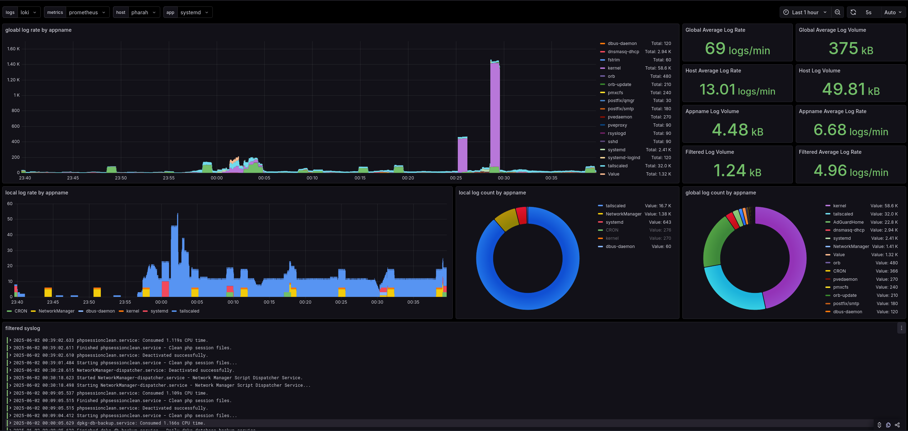

# Monitoring Stack

A monitoring stack consisting of Grafana, Loki, Prometheus, and Alloy for comprehensive logging and metrics visualization. I am running this on a Proxmox LXC, I set it up as a simple logging facility for different hosts/servers on my local network. Alloy was installed as a standalone binary because I could not build the docker image with the required integrations for my goal. The included alloy config should be enough to handle syslog from hosts and forward it to Loki.

This is the second time that I setup something like this and would like to document and not forget how I did it if ever I need to redeploy it.

## Prerequisites

- Docker
- Docker Compose
- At least 4GB of RAM available
- Alloy binary installed (for syslog processing)

## Components

- **Grafana**: Visualization and analytics platform (port 3000)
- **Loki**: Log aggregation system (port 3100)
- **Prometheus**: Metrics collection and storage (port 9090)
- **Alloy**: Syslog processing and relabeling system with structured logging support

## Configuration

### Environment Variables
No environment variables are required by default, but you can customize the configuration by creating a `.env` file with the following optional variables:

```env
GRAFANA_PORT=3000
LOKI_PORT=3100
PROMETHEUS_PORT=9090
```

### Custom Configuration
- Loki configuration can be modified in `loki/config.yml`
- Prometheus configuration can be modified in `prometheus/prometheus.yml`
- Alloy configuration can be modified in `alloy/config.alloy`

## Getting Started

1. Start the stack:
   ```bash
   docker compose up -d
   ```

2. Access Grafana:
   - URL: http://localhost:3000
   - Username: admin
   - Password: admin

## Services

- Grafana: http://localhost:3000
- Loki: http://localhost:3100
- Prometheus: http://localhost:9090

## Data Persistence
The stack uses Docker volumes for data persistence:
- loki-data: Loki storage
- prometheus-data: Prometheus storage
- grafana-storage: Grafana configurations and dashboards

## Stopping the Stack

```bash
docker compose down
```

## Alloy Configuration

The Alloy service is configured to process syslog input with the following features:
- Live debugging enabled for troubleshooting
- Structured logging with automatic field relabeling
- Processes multiple syslog fields including:
  - Application name → service_name, app
  - Hostname → host
  - Severity → level
  - Facility → facility
  - Connection details → connection_host, ip
  - Host IP tracking
 
## Host/Client Configuration
- Unraid - set syslog server to point to the stack's IP:PORT TCP(1601)/UDP(1514) 
- Raspbian OS - Install rsyslog and create a config containing the stack's information. Sample below:

/etc/rsyslog.d/99-loki.conf
```
*.*  @192.168.1.164:1514
```

## Grafana Dashboard Config

Added a Grafana dashboard json file that can be use alongside this stack. Based on [Grafana - Syslog](https://grafana.com/grafana/dashboards/16061-syslog/). Updated the labels and variables to make it work on my setup.




## Contributing

Contributions and suggestiong are welcome! Please feel free to submit a Pull Request.

## License

This project is licensed under the MIT License - see the [LICENSE](LICENSE) file for details
